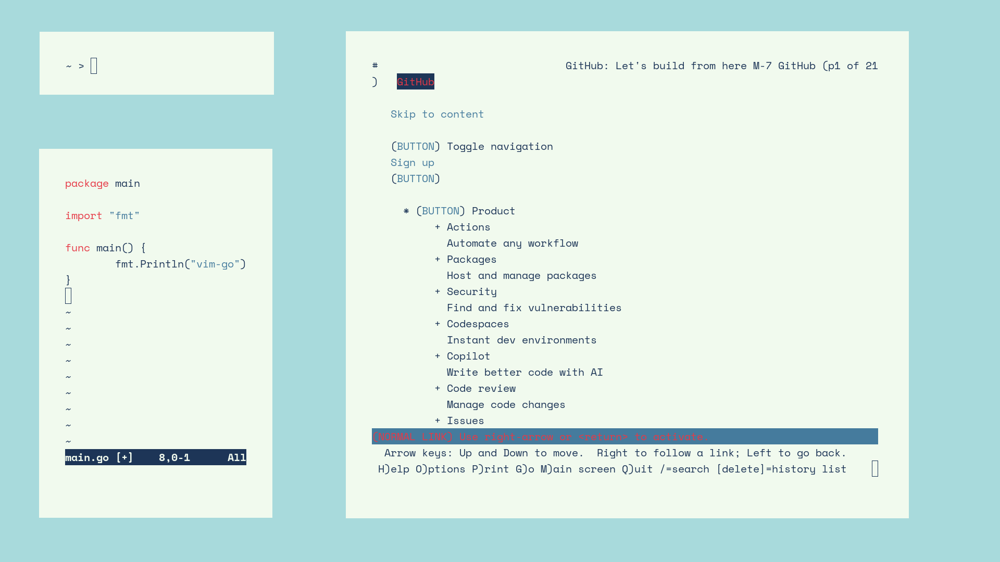

## screenshots

## what software is used

- [void linux](https://voidlinux.org/)
- [sowm](https://github.com/dylanaraps/sowm/)
- [st](https://st.suckless.org/)
- [nvim](https://github.com/neovim/neovim/)
- [lynx](https://lynx.invisible-island.net/)
- [feh](https://feh.finalrewind.org/)

## what colors are used

- #e63946 (red)
- #f1faee (white)
- #a8dadc (light blue)
- #457b9d (mid blue)
- #1d3557 (dark blue)

## what font is used

[space mono](https://github.com/googlefonts/spacemono)

## guidelines (incomplete)

nothing here yet

## some other tools i also use on this system

- [gh](https://cli.github.com/)
- [go](https://go.dev/)
- [keepassxc-cli](https://keepassxc.org/)

## kudos

[u/Dylan112](https://www.reddit.com/r/unixporn/comments/hzxe3i/sowm_oo) - inspo

[coolors.co](https://coolors.co/palette/e63946-f1faee-a8dadc-457b9d-1d3557) - cool color palettes
