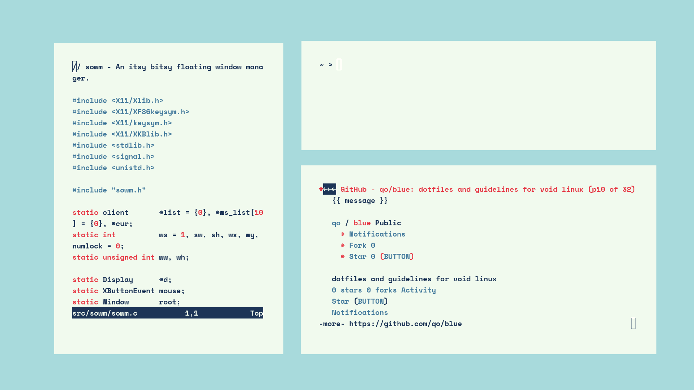
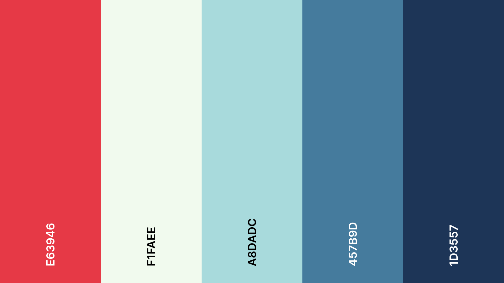

### screenshots

### what software is used

- [void linux](https://voidlinux.org/)
- [sowm](https://github.com/dylanaraps/sowm/)
- [st](https://st.suckless.org/)
- [nvim](https://github.com/neovim/neovim/)
- [lynx](https://lynx.invisible-island.net/)
- [feh](https://feh.finalrewind.org/)

### what colors are used

- #e63946 (red)
- #f1faee (white)
- #a8dadc (light blue)
- #457b9d (mid blue)
- #1d3557 (dark blue)

### what font is used

[space mono](https://github.com/googlefonts/spacemono)

### guidelines (incomplete)

#### install void linux

use network source during installation

#### install git

`sudo xbps-install git`

#### copy this repo

`git clone https://github.com/qo/blue`

#### install other necessary dependencies 

`sudo xbps-install xorg libX11-devel libXft-devel ncurses-devel openssl-devel gcc make neovim wget lynx feh`

#### copy dotfiles that should be placed at ~

`cp -a blue/home/. ~`

#### download sowm and st

`sudo mkdir /usr/local/src && cd /usr/local/src && git clone https://github.com/dylanaraps/sowm && git clone git://git.suckless.org/st`

#### copy config for sowm and compile it

`cp ~/blue/sowm/config.h sowm/ && cd sowm/ && make all && cd ..`

#### copy config for st and compile it

`cp ~/blue/st/config.h st/ && cd st/ && make all &&  cd ..`

#### create symbolic links for binaries of sowm and st

`sudo mkdir /usr/local/bin && cd /usr/local/bin && sudo ln -s /usr/local/src/sowm/sowm sowm && sudo ln -s /usr/local/src/st/st st && cd ~`

#### copy lynx binary to userspace

`sudo cp /bin/lynx /usr/local/bin`

#### copy wallpaper

`mkdir pictures && cp blue/wallpaper/wallpaper.png pictures/`

#### add your name to .xinitrc and .fehbg

`nvim .xinitrc`

`nvim .fehbg`

#### download font

`cd /usr/share/fonts && sudo git clone https://github.com/googlefonts/spacemono  && cd ~`

#### copy lynx config

`sudo cp -a /blue/lynx/. /etc`

#### copy nvim config

`mkdir .config && mkdir .config/nvim && cp -a blue/nvim/. .config/nvim`

#### start x server

`startx`

#### open terminal

press `win+enter` to open your terminal

#### move & resize your windows

use `win+lmb` & `win+rmb`

#### keep it going

use `nvim` as a text editor & `lynx` as a web-browser

### some other tools i also use on this system

- [gh](https://cli.github.com/)
- [go](https://go.dev/)
- [keepassxc-cli](https://keepassxc.org/)
- [scrot](https://github.com/dreamer/scrot)

### kudos

[u/Dylan112](https://www.reddit.com/r/unixporn/comments/hzxe3i/sowm_oo) - inspo

[coolors.co](https://coolors.co/palette/e63946-f1faee-a8dadc-457b9d-1d3557) - cool color palettes
